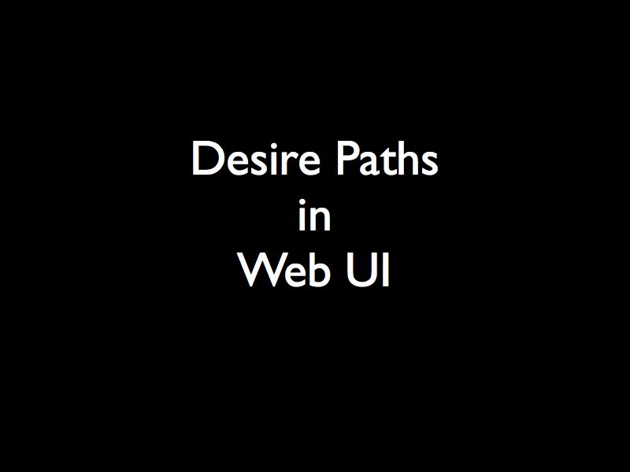
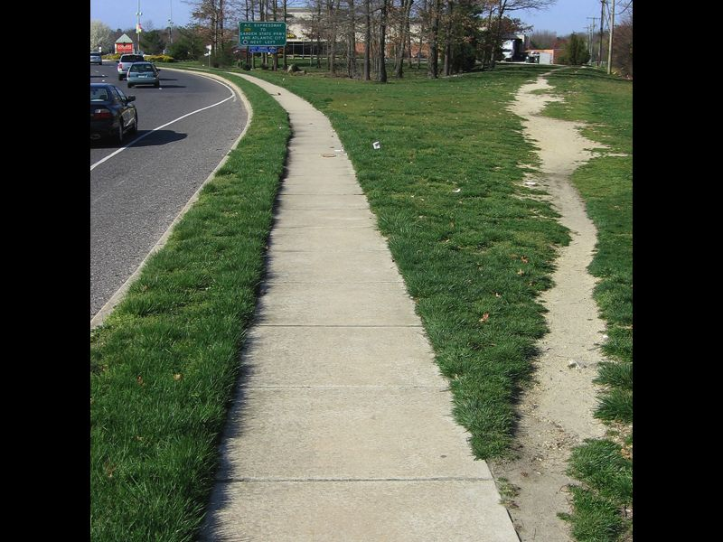
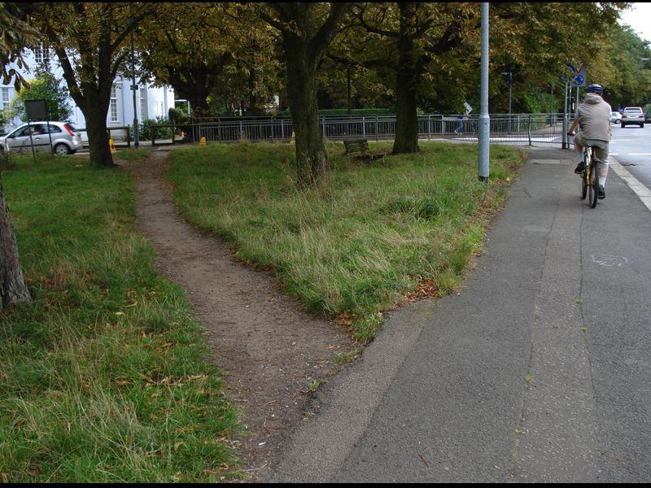
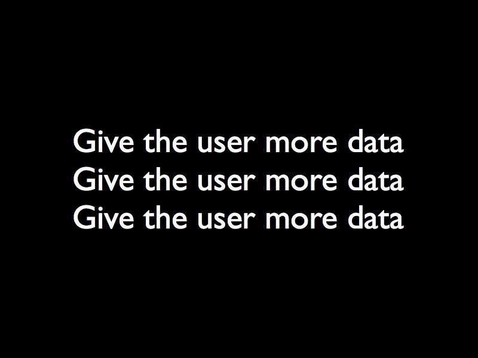
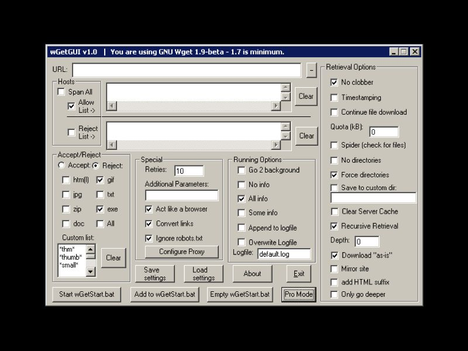
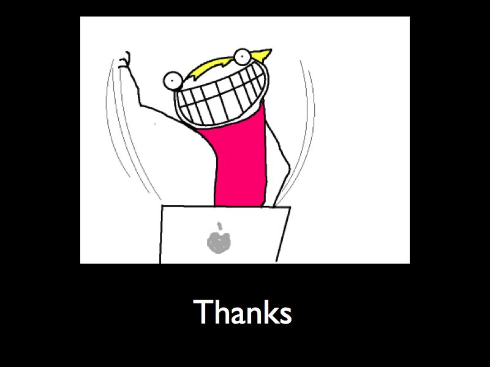

Slides and a rough transcription from my lightning talk at the [@chchruby](https://twitter.com/chchruby) meetup on Thursday, 16th May, 2013.

Hi everyone, I'm Daniel Fone. I'm a freelance Rails engineer.

Before I start, I want to frame this by saying, this is more of a general "philosophy of web application design" than a technical talk so feel free to disagree — I don’t think there’s right and wrong — but hopefully these musings are helpful to some of you

Ok, so “desire paths in web UI” Who's heard of these before? Who knows what a desire path is?

Ok, who knows what a web UI is? Good, we've got something to start with…

Desire paths are something that everyone’s familiar with, you probably just didn’t know they had a name:

Little story…
I’ve got two little kids, and sometimes [Mummy needs a minute](http://www.kungfugrippe.com/post/631603366/mommy-needs-a-minute)
so Daddy takes the kids for endless walks in the parks around where we live. There’s heaps.
And everywhere we go we see these things:

Those tracks you see between trees, between paved footpaths etc.
that’s a desire path

When someone designed the paths, they figured everyone wanted to walk “here”
turns out everyone wants to walk “over here”

Totally different story time:

 ages ago I built a search feature for a client's in-house logistics system.
kinda omnisearch, searches all these different fields, fuzzy matches etc.
Some time later I was working with one of the users while they were using this system
and they were looking for a particular Order or Parcel or something
and instead of using my amazing search
they clicked on the “All Orders” tab, went ctrl-f and typed in the order number they were looking for.
So they just used the browser’s search function.

Turns out there was one field that was shown on the “All Orders” list that wasn’t shown on the search results page, so they were saving themselves an extra click by just going ctrl -> find on the orders list.

I designing the app, I never would've thought about this particular edge case.

And it got me thinking…
These two stories are actually about the same thing!

Because really, a desire path is
the disconnect between a **designer's intention**
and a **user's desires**

Here’s the dilema for us as application developers

When I’m sitting down with a client and they want this new-fangled in house management tool.

* firstly, I don’t have any idea what their users (usually their staff) actually want
* secondly, the technical managers I’m talking to usually only have a limited idea
* finally, if you talk with the future users about how they do their job, and how they want this application to work… they have no idea either until they start using it!

Basically, no-one knows exactly what they want until it’s in-front of them,
and then all they know they want something slightly different.

So what are we to do?

Here’s my pet theory…

**Build paths, not corridors.**

Going back to our outdoor examples,
paved footpaths leave users the opportunity to express desire paths
they can take shortcuts when they know where they’re going

Corridors don’t leave opportunities for desire paths. You go the way the architect intended you to.

I know what you’re thinking at this point…

Yeah. paths, corridors, muddy tracks in the ground. WAT.

So let’s put some legs on this.
Technically, what does this look like?

1. Display more data, not less. Perhaps you have to hide it behind a “show more” link. But if you give it to the user, they can do something with it. This is the difference between omitting data and hiding it. I’ll come back to this in a sec.

1. Give the users all their data. export via CSV/XML whatever. In the business world, if they can get data out of your system and into excel, they can do anything with it. Like people can do ANYTHING with excel.

1. Expose APIs, same idea. Give them the data and let them find the ways they want to use it.

There's a caveat though…

Letting users make desire paths doesn’t mean making none of your own paths in the UI.
You’ve still got to make decisions.

New users of your application need to see well marked paths so they learn how this information system works.
But as users become comfortable, they want the space to find their own shortcuts etc.
So it is good to **hide** all the unneeded data, but it’s not good to **omit** it entirely.

For bonus points…

If you’re doing SaaS or whatever, i.e. building value into your own product
You can leverage desire paths.

And if you can analyse your logs, or implement some JS tracking,
Or — heaven forbid — talk to your users!

You can discover the odd use cases you’d never thought of and then build those out.

So to recap:

0. Let your users figure out how to do cool stuff with your app.
0. Figure out what cool stuff they’re doing
0. And then make it easier for everyone

But basically…

**Build paths, not corridors.**

Whatever that means for you.

THANKS
